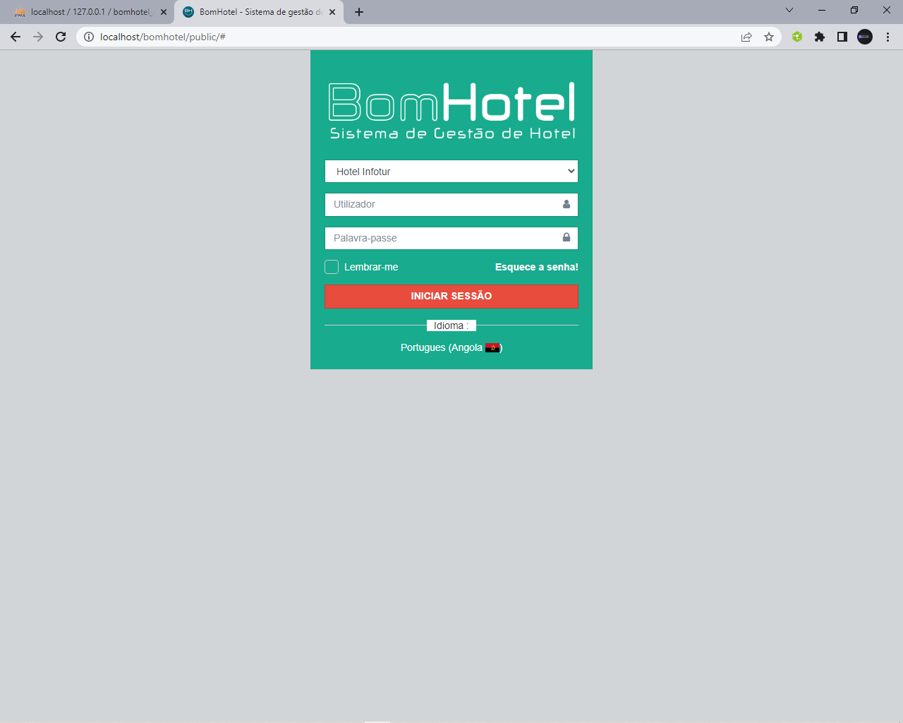

# SISTEMA DE GESTÃO  DE HOTEL
Durante a minha jornada como programador chegei a trabalhar com diversas ferramentas, e em cada ferramenta obtive um apredizado que levo até hoje. Estava navegando  no meu computador e encontrei esse projeto que desenvolve utilizando  o Laravel Framework, foi uma expreriencia muito divertida.

## Ferramentas utilizadas

- Php(Framework Laravel)
- Mysql
- HTML,CSS,JavaScript

## About Laravel

Laravel is a web application framework with expressive, elegant syntax. We believe development must be an enjoyable and creative experience to be truly fulfilling. Laravel takes the pain out of development by easing common tasks used in many web projects, such as:

- [Simple, fast routing engine](https://laravel.com/docs/routing).
- [Powerful dependency injection container](https://laravel.com/docs/container).
- Multiple back-ends for [session](https://laravel.com/docs/session) and [cache](https://laravel.com/docs/cache) storage.
- Expressive, intuitive [database ORM](https://laravel.com/docs/eloquent).
- Database agnostic [schema migrations](https://laravel.com/docs/migrations).
- [Robust background job processing](https://laravel.com/docs/queues).
- [Real-time event broadcasting](https://laravel.com/docs/broadcasting).

Laravel is accessible, powerful, and provides tools required for large, robust applications.

# TELA DE LOGIN

